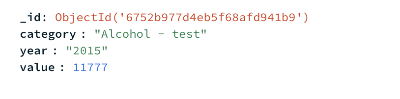

# Data Structure  

## Data Structure in MongoDB  
  

### Fields Explanation  
- **`_id`**:  
    - Automatically generated by MongoDB as a unique identifier for each document.  

- **`category`**:  
    - Represents the category of the violation (e.g., traffic, theft, etc.).  

- **`year`**:  
    - A string indicating the year the data corresponds to (e.g., `"2024"`).  

- **`value`**:  
    - An integer representing the numerical value associated with the category for the specified year.  
    - This field is used for calculations and statistical analyses.  

### Example Document  
```json
{
    "_id": "64a2b5d8e7a8e",
    "category": "Traffic Violation",
    "year": "2024",
    "value": 1200
}
```

## Data Handling Process

I fetched data from the Belgian police, saved it into MongoDB, and used that data to display on my page. By doing this, I ensure I have a backup in case the data source becomes unavailable. I added an update button that checks for duplicates and new entries, adding new violations for the year 2024. I chose this approach because in the past, the data was only updated yearly and not frequently.